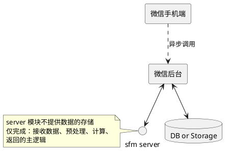

# SFM 算法开发 && 部署 设计文档

## 算法调用设计

```plantuml
@startuml

note left of sfm
    尝试封装成可服用模块
end note

component sfm{    
    component core{
        () "rebuild" as sfm_call
    }
    component datas{
        class Camera{
            + float mrt
            + npt.NDArray[np.float]  k
            + float x
            + float y
        }
        
        abstract ImageDataset{
            + int __len__()
            + npt.NDArray[np.uint8] __getitem__()
            + Iterator[npt.NDArray[np.uint8]] __iter__()
        }
        class SFMData{
            + Optional[Camera] camera
            + ImageDataset image
        }
    
        Camera --> SFMData
        ImageDataset --> SFMData
    
        class ColorPoints{
            + Any points
            + Any colors
        }
        note left of ColorPoints
        返回一个可迭代对象,存放点云,形如列表
        单个元素为列表/np 矩阵/ Point 对象
        
        需要存放颜色
        end note
            
        note left of SFMData
        调用需要传递的参数
        end note
    }
    
    
    component utils{
    
        class LocalStorageImageDataset{
        }
        note right of LocalStorageImageDataset
            ImageDataset 子类
            用于开发期间本地数据测试
        end note
        LocalStorageImageDataset --|> ImageDataset
        
        () fig_v1
        note left of fig_v1
        开发调试期间,作图显示用
        end note
    }
    
    SFMData --> sfm_call: 参数传入,调用sfm 做点云生成
    sfm_call --> ColorPoints
}

note left of server
    提供网络服务,供网络调用
end note

component server{
    note left of CustomImageDataset
        自定义的
        关乎于网络数据传输和加载的
        图片数据集载入方式
    end note    
    CustomImageDataset --|> ImageDataset
    class CustomImageDataset{
    }
    
    () start
    note left of start
        运行该函数,将启动websocket 服务
    end note
    
}

@enduml
```

## `rebuild` 内部流程

该函数将执行SFM 主逻辑,核心代码参考仓库历史中的 `revise_v2.py` 代码.

## `server` 设计

### 背景

- 目的是用于小程序端使用
- 目前小程序已有基于django 开发,部署于 `k8s` 的服务

### 关键点



目前的关键点出自于对小程序端使用的场景的预设构思（如上图），会随需求变动而变动

- 不直接提供小程序端可网络调用的接口
- 不内置存储(由django-web 完成实际调用后,做数据的存储)
- 需解决调用时的多图数据传输以及计算等实际处理的耗时
- 部署方案上,需解决 `k8s`方式部署的程序和普通方式部署的程序,彼此调用可达

### 计划实际采用的方案

- 数据传输协议？~~websocket 还是~~ grpc
- 数据格式？直接发送图片内容~~，还是发送图片线上地址？~~
