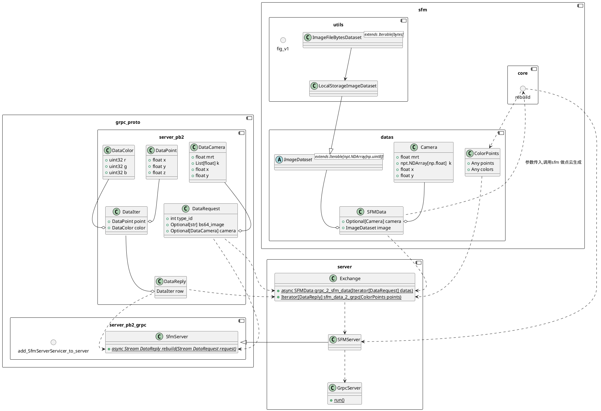
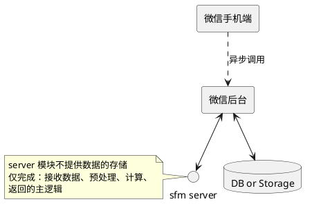

# SFM 算法开发 && 部署 设计文档

## 算法调用设计

## `rebuild` 内部流程

该函数将执行SFM 主逻辑,核心代码参考仓库历史中的 `revise_v2.py` 代码.

## `server` 设计

### 背景

- 目的是用于小程序端使用
- 目前小程序已有基于django 开发,部署于 `k8s` 的服务

### 关键点

目前的关键点出自于对小程序端使用的场景的预设构思（如上图），会随需求变动而变动

- 不直接提供小程序端可网络调用的接口
- 不内置存储(由django-web 完成实际调用后,做数据的存储)
- 需解决调用时的多图数据传输以及计算等实际处理的耗时
- 部署方案上,需解决 `k8s`方式部署的程序和普通方式部署的程序,彼此调用可达

### 计划实际采用的方案

- 数据传输协议？~~websocket 还是~~ grpc
- 数据格式？直接发送图片内容~~，还是发送图片线上地址？~~
