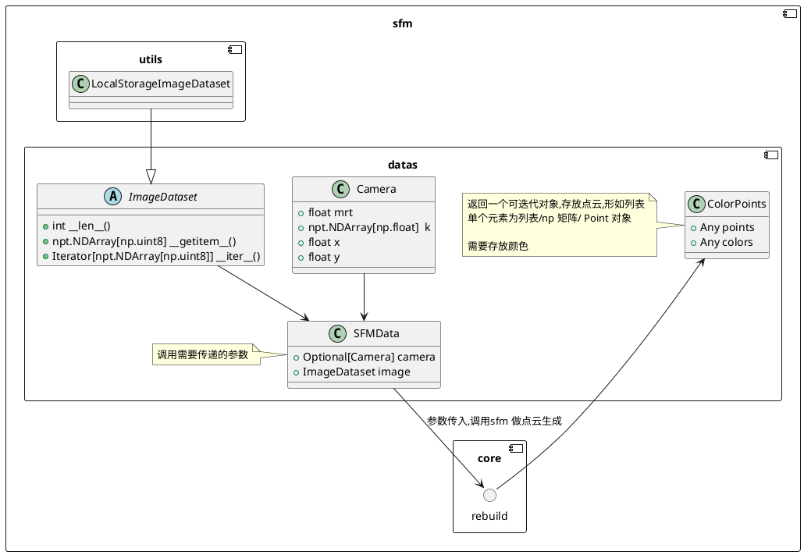

# SFM 算法开发 && 部署 设计文档

## 算法调用设计

```plantuml
@startuml
component sfm{
    component core{
        () "rebuild" as sfm_call
    }
    component datas{
        class Camera{
            + float mrt
            + npt.NDArray[np.float]  k
            + float x
            + float y
        }
        
        abstract ImageDataset{
            + int __len__()
            + npt.NDArray[np.uint8] __getitem__()
            + Iterator[npt.NDArray[np.uint8]] __iter__()
        }
        class SFMData{
            + Optional[Camera] camera
            + ImageDataset image
        }
    
        Camera --> SFMData
        ImageDataset --> SFMData
    
        class ColorPoints{
            + Any points
            + Any colors
        }
        note left of ColorPoints
        返回一个可迭代对象,存放点云,形如列表
        单个元素为列表/np 矩阵/ Point 对象
        
        需要存放颜色
        end note
            
        note left of SFMData
        调用需要传递的参数
        end note
    }
    
    
    component utils{
    
        class LocalStorageImageDataset{
        }
        LocalStorageImageDataset --|> ImageDataset
    }
    
    SFMData --> sfm_call: 参数传入,调用sfm 做点云生成
    sfm_call --> ColorPoints
}


@enduml
```

## `rebuild` 内部流程

